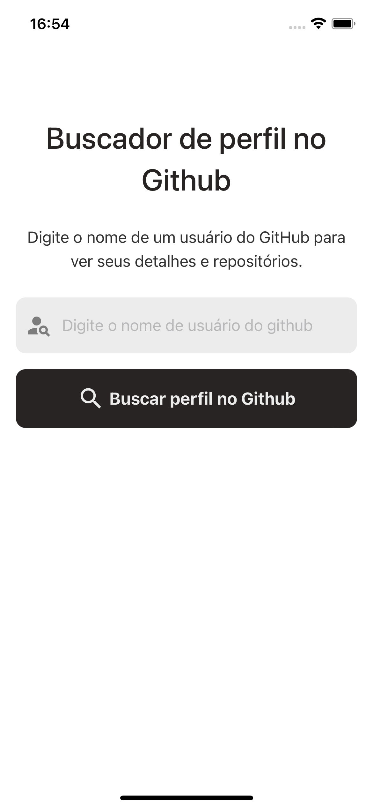
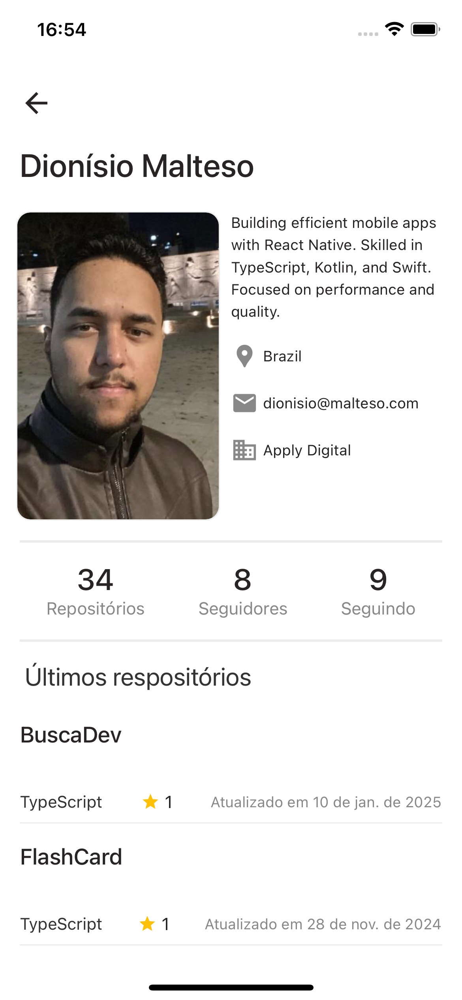
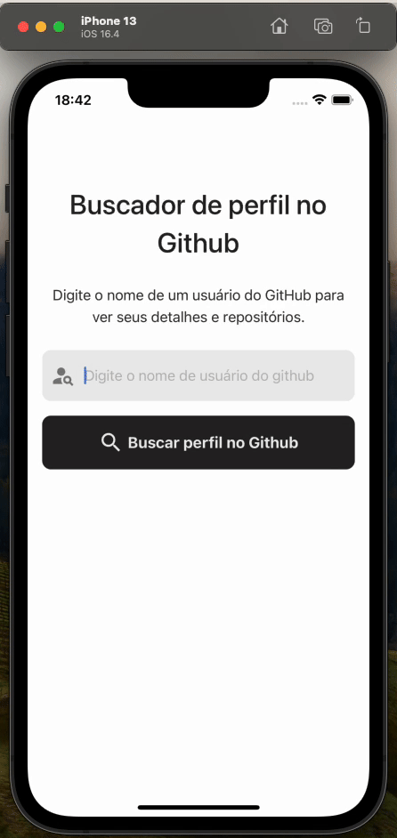
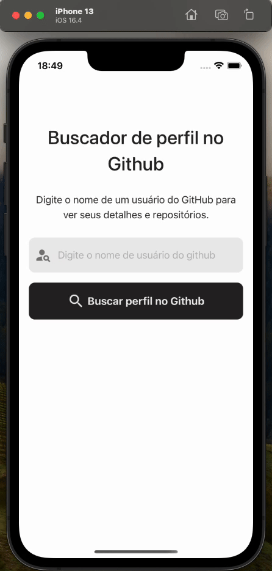
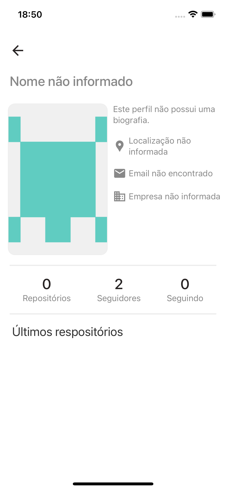
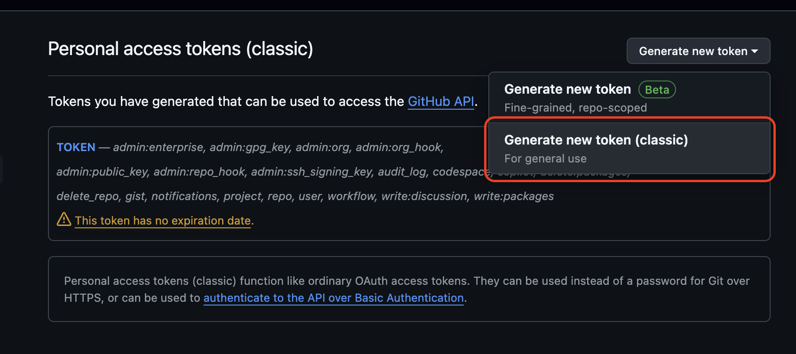
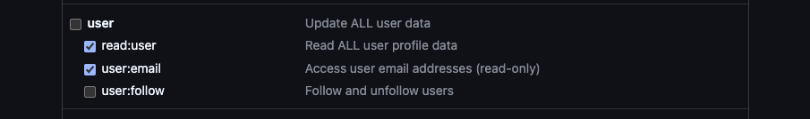

# **BuscaDev**

## 📖 **About**

Este é um projeto **React Native** projetado para ser o **Busca Dev** pode ser utilizado para pesquisar e exibir informações sobre usuários do GitHub. Desenvolvido sobre a [API do GitHub](https://docs.github.com/en/rest), o aplicativo busca detalhes do usuário, repositórios e outros dados importantes.

## ✨ **Features**

- 🔍 **Buscar usuário do github pelo nome de usuário.**
- 📄 **Ver detalhes do usuário:**
  - Nome
  - Localização
  - Empresa
  - Email
  - Seguidores
  - Seguindo
  - Bio
  - Repositórios Públicos
- 📊 **Eplore os repositórios:**
  - **Nome**
  - **Estrelas**
  - **Última alteração**
- 🌐 **Abrir o repositório direto no GitHub.**

## 🛠️ **Feito com**

Este projeto foi criado com as seguintes tecnologias:

- **React Native 0.76**
- **TypeScript**
- **Context API**
- **Axios**
- **React Navigation**
- **Styled Components**
- **React Native Vector Icons**
- **React Native Testing Library**

O projeto possui testes nos componentes principais e também nas páginas do APP.


## 📱 **Imagens**

| **Página de pesquisa**               | **Detalhes do usuário**               |
|-----------------------------|-----------------------------|
| | | 


## 📱 **Vídeos de demonstração**

| **Pesquisar usuário**               | **Dados do usuário**          | **Scroll Infinito**       |
|--------------------------|-------------------------------|-------------------------------|
|  |  |  |

## 📱 **Tratamento de erros**

| **Nomes errados**               | **Usuários sem dados**               |
|-----------------------------|-----------------------------|
| | | 


## 🚀 **Começando**

### **Pré-requisitos**

Certifique-se de ter o seguinte instalado no seu sistema:

- [Node.js](https://nodejs.org/)
- [Yarn](https://yarnpkg.com/)
- React Native CLI (`npm install -g react-native-cli`)

### Step 1: Clone o repositório na sua máquina
  ```bash
   git clone https://github.com/dionisio28/BuscaDev.git
   cd BuscaDev
   ```
 ### Step 2: Instalando as dependências
  ```bash
   yarn
   ```
   Para iOS tem um passo adicional
   ```bash
   cd ios
   pod install
   ```

### Step 2: Inicie o METRO do React Native

Comece iniciando o **Metro**, o empacotador JavaScript que vem com o React Native.

```bash
# Usando npm
npm start

# Usando Yarn (Recomendado)
yarn start
```

### Step 3: Iniciando a aplicação
Com o Metro rodando em um terminal, abra um novo terminal e execute seu aplicativo.

Para Android

```bash
# Usando npm
npm run android

# Usando Yarn (Recomendado)
yarn android
```

For iOS

```bash
# Usando npm
npm run ios

# Usando Yarn (Recomendado)
yarn ios
```

### Step 4: Configurando seu ambiente (.env)
Para buscar as informações completas dos usuários é necessário configurar um Token para a API do Github.

Sem o Token você não conseguirá buscar algumas informações do usuário como por exemplo o **e-mail**.

Você pode conseguir o seu token através deste link

- [Personal access tokens (classic)](https://github.com/settings/tokens)


Clique em generate new Token (classic)

**Imagem de ajuda**            
  Aqui marque os campos
 **read:userRead, user:emailAccess, public_repo, read:packages, read:enterprise, read:gpg_key** ou outros dados que deseja buscar.
   | 

Após isso é necessário criar um arquivo **.env** em seu código e definir a variável de ambiente ``GITHUB_TOKEN``.

  ```bash
  GITHUB_TOKEN=<SEU_TOKEN>
   ```

Pronto após essas configurações o projeto ira funcionar normalmente!